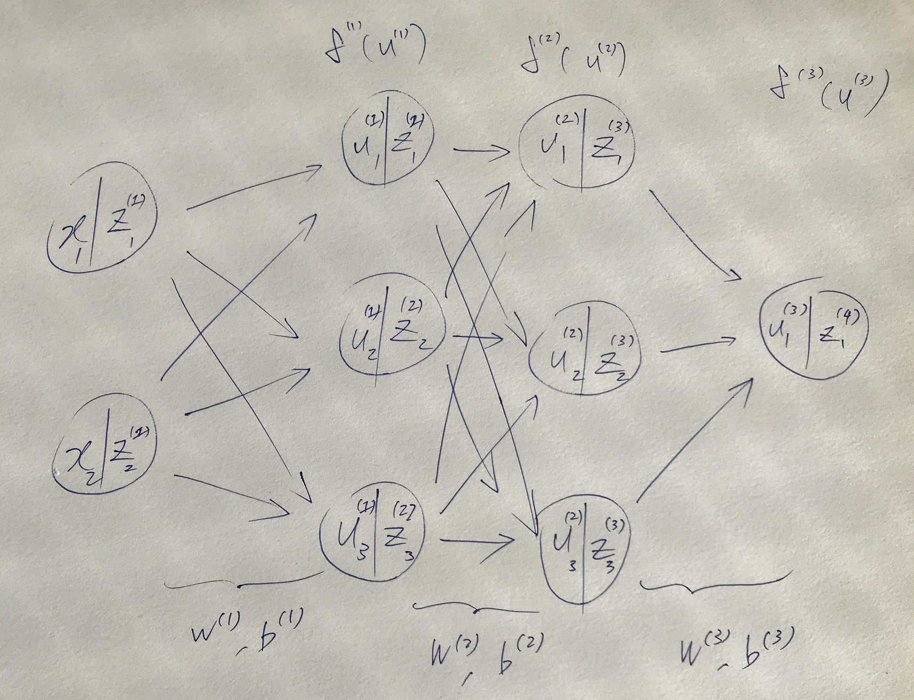

# DAY1 ニューラルネットワーク

## Section 1) 入力層～中間層

### 確認テスト
ディープラーニングとは
- 多数の中間層を持つニューラルネットワークを用いて、入力値から目的とする出力値に変換する数学モデルを構築する
- 重み(w)とバイアス(b)の最適化を目的とする

### 確認テスト
ニューラルネットワークの構造
- 入力層２ノード：x1, x2
- 中間層２層各３ノード:
  - u1(1),u2(1),u3(1) 
  - u1(2),u2(2),u3(2) 
- 出力層１ノード：y1

隣り合う層のノードは網羅的に結合される。（層ＡとＢ間の経路の数は、層Ａのノード数 x 層Ｂのノード数）



### ＮＮの対象とする問題
- 回帰：連続値
- 分類：離散値

### 確認テスト
ニューラルネットワークと分類問題との対応
- 入力：観測値：動物の種類の分類の場合、体重や各部位の長さ（アヤメの分類でも同様）など
- 出力：クラス：動物の種類の分類の場合、「犬」や「猫」など

### 確認テスト
入力(x)と重み(W)、バイアス(b)から中間層の入力 (u)を求める式のPythonによる表現

```python
u = np.dot(x, W) + b
```

```python
u = W @ x.T + b
```

### 確認テスト
中間層の出力のPythonによる表現
```python
z = functions.relu(u)
```

## Section 2) 活性化関数

### 確認テスト
「線形」と「非線形」の違い
- 線形な関数
  - 加法性: f(x +y) = f(x) + f(y)
  - 斉次性: f(kx) = kf(x)
- 非線形な関数
  - 加法性・斉次性を満たさない
### 図示（グラフ）による表現（特徴）  
- 線形な関数
  - 真っ直ぐな線
- 非線形な関数
  - 曲線

### 中間層用の活性化関数
#### ステップ関数
しきい値を超えると発火する。出力は１か０

#### シグモイド（ロジスティック）関数
０～１の間を緩やかに変化する関数。

課題：大きな値では出力の変化が微小なため、勾配消失問題を引き起こすことがあった。

出力が0にならないため、スパース化できない。

```
0.5 *  ( 1 + e^(-x) )
```


σ(0) = 0.5

σ(x)においてx > 0 なら　σ(x) > 0.5

σ(x)においてx < 0 なら　σ(x) < 0.5

```
def sigmoid(x):
    return 1/(1 + np.exp(-x))
```


#### ReLU関数
- もっとも使われている活性化関数。
- 勾配消失問題の回避とスパース化（出力が0になるため）に貢献することでよい成果をもたらすことができる
- 0以下の入力は、常に0。入力0以上の場合x

```
def relu(x):
    return np.maximum(0, x)
```

#### 確認テスト
活性化関数（ z = f(u) ）のPythonコードブロック（sigmoid関数のケース）

```
z = functions.sigmoid(u)
```


## Section 3) 出力層

### 3-1 誤差関数

#### 確認テスト
二乗和誤差(残差平方和)の計算式の意味
- 差が消しあわないように、それぞれのラベルが正の値になるように、二乗する。
- 誤差逆伝搬の計算で、誤差関数の微分を用いるがその際の計算を簡単にするため、（二乗した値の和の）1/2として定義（微分による打ち消しあいで1にするため）

- 分類問題 - クロスエントロピー誤差
- 回帰問題 - mean squared error

### 3-2 出力層の活性化関数

出力層と中間層で利用される活性関数は異なる。

- 中間層：閾値の前後で信号の強弱を調整
- 出力層：信号の大きさ（比率）はそのままに変換。分類問題では、総和を１とするよう調整

- 恒等写像：回帰
  - なにもしない
  - 誤差関数：（平均）二乗誤差
 
- シグモイド（ロジスティック）関数：二値分類
  - 誤差関数：交差エントロピー
  
- ソフトマックス関数：多クラス分類
  - 誤差関数：交差エントロピー
  - 全体を足すと１になる確率数を出力する
  
#### 確認テスト
ソフトマックス処理解説

ソフトマックス関数定義
```
f(i, u) = e^u_i / Σ_k=1^k e^u_k
```
上記の分割とコードとの対応・差異を以下に示す。
```
①　f(i, u)

②　e^u_i

③　Σ_k=1^k e^u_k
```

```python
def softmax(x):　# ①と異なり、iは関数の引数でないが、引数xは、uのすべての要素でありうる（バッチ処理）
  if x.ndim == 2: # ミニバッチとしての処理の分岐
    x = x.T # 計算のための次元の変換
    x = x - np.max(x, axis=0) # オーバーフロー対策
    y = np.exp(x) / np.sum(np.exp(x), axis=0) # ② / ③
    return y.T # 入力と同じ構造に戻す
  x = x - np.max(x) # オーバーフロー対策
  return np.exp(x) / np.sum(np.exp(x))　#　② / ③
```

#### 確認テスト
交差エントロピー処理解説

交差エントロピー関数定義
```
E_n(W) = - Σ_i=1^I d_i log y_i
```

```
def cross_entropy_error(y, d): # モデルの計算結果と教師データから誤差を求める
  if y.ndim == 1:
    d = d.reshape(1, d.size)
    y = y.reshape(1, y.size)
  # 教師データがOne-hot-vectorの場合、正解ラベルのインデックスに変換
  if d.size == y.size:
    d = d.argmax(axis=1)
    batch_size = y.shape(0)
  return -np.sum(np.log(y[np.arrange(batch_size), d] + le-7)) / batch_size　# ゼロによる演算を避けるため微小値(le-7)を加えている
```

- `np.log(y[np.arrange(batch_size), d] + le-7)`が式右辺に対応

- 対数関数ではXが０に近づくと、yがマイナス無限大に近づく。`le-7`を足すことで、それを回避している（コンピュータ計算上の工夫）。

入力例示
```
d = np.array([4,2])#正解データ
y = np.array([[0.1,0.05,0.05,0.1,0.7],[0.1,0.2,0.4,0.1,0.2]])#softmax関数の出力値
```

## Section 4) 勾配降下法

ＮＮを学習させる手法。勾配降下法を利用してパラメータを最適化する。

### 確認テスト
勾配降下法のPythonコードによる確認
```
W^(t+1) = w^(t) - ε∇E_n
```
```
network[key] -= learning_rate * grad[key]
```
```
∇E = ∂E/∂W = [ (∂E/∂W_1) ... (∂E/∂W_M)]
```
```
grad = backward(x, d, z1, y)
```


学習率εを適切に設定する
- 学習率 大：発散
- 学習率 小：時間がかかる。局所解になりかねない。


### 確率的勾配降下法（ＳＧＤ）
確率的勾配降下法
```
W^(t+1) = w^(t) - ε∇E_n
```
勾配降下法
- バッチ学習に対応
```
W^(t+1) = w^(t) - ε∇E
```
ランダムに抽出したサンプルの誤差

メリット
- データが冗長な場合の計算コストの軽減
- 望まない局所極小解に収束するリスクの軽減
- オンライン学習（バッチ学習とは異なり最初にデータをすべて準備する必要がない）が可能


### オンライン学習

#### 確認テスト
オンライン学習とは
- 学習データが入ってくる度に都度パラメータを更新し、学習を進めていく方法
  - 対してバッチ学習では、一度にすべての学習データを使ってパラメータ更新を行う
- 確率的勾配降下法は、オンライン学習に用いることができる

### ミニバッチ勾配降下法
ランダムに分割したデータの集合（ミニバッチ）D_tに属するサンプルの平均誤差を用いる。

メリット
- 確率的勾配降下法のメリットを損なわず、計算機の計算資源を有効利用でき
- CPUを利用したスレッド並列化や、GPUを利用したSIMD(Single Instruction Multi Data)並列化

#### 確認テスト
重み更新の解説（図示）
```
W^(t+1) = w^(t) - ε∇E
```
- t:エポック
- w:重み
- １エポック進むごとに重みから`ε∇E`（誤差）を引く
- t+1時点のWは、t時点でのWから、t時点での誤差E/傾き/勾配/微分値（を学習係数ϵで調整したもの)を引いた結果


### SGDの改良
#### Adagrad
- 各パラメータの要素ごとに学習率を調整することで学習を行う
- 各要素の学習率を決めるために変数(h)を導入
- hを勾配の絶対値の大きい（小さい）要素には更新量を小さく（大きく）することで学習率を調整

```
params[key] -= self.lr * grads[key] * ( 1 / np.sqrt(self.h[key' + 1e-7))
```
- hが逆数（学習率反転）
- 0で割り算を行わないよう、微小値を付与


#### Momentum
パラメータの更新に過去の勾配も用いる

```
self.v[key] = self.momentum * self.v[key] - self.lr * grads[key]
```
#### RMSprop
AdaGradの更新をしばらく行っていくと、更新量がゼロに近づいていき、パラメータ更新を行うことができなくなる問題を解決するために開発された。

AdaGradに加えて、時間が経過するほど更新幅が小さくなるようにdecayを用いて学習率を計算。

#### Adam
MomentumとRMSPropを組み合わせたアルゴリズム


## Section 5) 誤差逆伝播法

### 誤差勾配の計算
#### 数値微分
プログラムで微小な数値を生成し、疑似的に微分を計算する手法
- デメリット：計算量が大きい

#### 誤差逆伝播法
産出された誤差を、出力層側から順に微分し、前の層、前の層へと伝播。
最小限の計算で各パラメータでの微分値を**解析的**に計算する手法

計算結果（＝誤差）から微分を逆算することで、不要な再帰的計算を避けて微分を算出できる。

微分の連鎖率を利用

数値微分のデメリットを回避することができる

#### 確認テスト
誤差逆伝播法のPythonコードによる確認

- 誤差逆電波法では不要な再帰的処理を避けることができる
- 計算結果を保持し使いまわすことができる

```
def backward(x, d, z1, y):
    grad = {}

    W1, W2 = network['W1'], network['W2']
    b1, b2 = network['b1'], network['b2']

    delta2 = functions.d_sigmoid_with_loss(d, y)

    grad['b2'] = np.sum(delta2, axis=0)

    grad['W2'] = np.dot(z1.T, delta2)

    delta1 = np.dot(delta2, W2.T) * functions.d_relu(z1)  
```
計算(シグモイド関数とクロスエントロピー誤差)を保存している部分
```
    delta2 = functions.d_sigmoid_with_loss(d, y)
```
誤差（過去の微分値）を微分した結果(delta2)の利用箇所
```
    grad['b2'] = np.sum(delta2, axis=0)

    grad['W2'] = np.dot(z1.T, delta2)

    delta1 = np.dot(delta2, W2.T) * functions.d_relu(z1)  
```

### 誤差勾配の計算式
```
∂E/∂w_ji^(2) = (∂E/∂y)(∂y/∂u)(∂u/∂w_ji^(2))
```
各項目についての計算式
```
(∂E(y)/∂y) = ... = y - d
```

活性化関数が恒等写像なので、`y = u`
```
(∂y(u)/∂u) = (∂u/∂u) = 1
```

バイアスは定数なので、微分の結果は、0になる。
```
(∂u/∂w_ji^(2)) = ... = [ 0 ... z ... 0].T
```

```
∂E/∂w_ji^(2) = (∂E/∂y)(∂y/∂u)(∂u/∂w_ji^(2)) = (y-d).[0 ... z_i ... 0].T = (y_j - d_j).z_i
```

#### 確認テスト
コードによる確認と考察

Eをyで微分(`(∂E/∂y)`)
```
delta2 = functions.d_mean_squared_error(d, y)
```

uで微分(`(∂E/∂y)(∂y/∂u)`)　/ b2の勾配を計算
```
grad['b2'] = np.sum(delta2, axis=0)
```

wで微分 (`(∂E/∂y)(∂y/∂u)(∂u/∂w_ji^(2))`) / W2の勾配を計算

```
grad['W2'] = np.dot(z1.T, delta2)
```


## 開発環境

- CPU
- GPU
- FPGA (Field Programmable Gate Array)
- ASIC (Application Specific Integrated. Circuit 特定用途向け集積回路)

## 入力層の設計

### 入力として取りうるデータ
- 連続する実数
- 確率
- フラグ値

### 入力層として取るべきでないデータ
- 欠損値が多い
- 誤差が大きい
- （ＮＮの）出力そのもの、出力を加工した情報
- 連続性のないデータ（背番号など）
- 無意味な数が割り当てられているデータ
  - 悪い例：Yes:1, No:0, どちらでもない: -1, 無回答:-1
  - より例：Yes:1, No:-1, どちらでもない: 0, 無回答:なし
  
### 欠損値の扱い
- ゼロで詰める
- 欠損値を含む集合を除外
- 入力として採用しない

### データの結合
対応のあるデータセットを結合して入力値として用いる

### 数値の正規化・正則化
- 1 ~ 0の範囲に数値をそろえる

### データ集合の拡張 Dataset Augumentation

分類タスクに向く

### 特徴量の転移

深層学習モデル　= 特徴量抽出 + タスク固有処理　（ゼロベースの学習）

ファインチューニング：ベースモデル重みを再学習（特徴量抽出＋タスク固有処理）
転移学習：ベースモデルの重みを固定（タスク固有処理）

#### 特徴量抽出
プリトレーニングで教師なし学習を行うことによって、効果的にモデルの性能を高めることができる。

例：VGG, BERT
