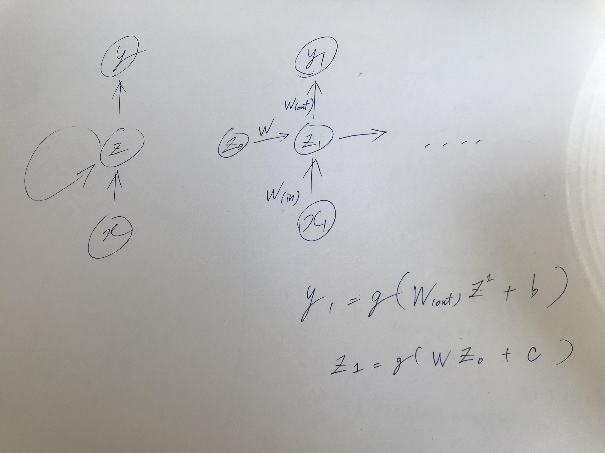

# DAY3 RNN

## 復習
##### 確認テスト
サイズ5×5の入力画像を、サイズ3×3のフィルタで 畳み込んだ時の出力画像のサイズを答えよ。 なおストライドは2、パディングは1とする。


```
( 5 + 2 * 1 - 3 ) / 2 + 1 = 3
```

## Section 1) 再帰型ニューラルネットワークの概念
### 1-1 RNN全体像
#### 1-1-1 RNNとは

時系列データに対応可能なニューラルネットワーク


##### 確認テスト
RNNにおける３種類の重みについて解説
- W_in：入力から現在の中間層を定義する際に掛けられる重み
- W_out：中間層から出力を定義する際に掛けられる重み
- W：t-1時点の中間層の出力を、t時点の入力として扱う際の重み

##### バイナリ加算
右から左に向かって時間的なつながりのある情報ととらえることができる（値の繰り上がり）

##### 演習チャレンジ
RNNを用いたNLPの実装において、活性化関数への入力を理解する。

```
v = _activation(W.dot(np.concatenate([left, right))
```

- 隣接単語（の表現ベクトル）からなる表現ベクトルを作る処理が問われている。
- これは、配列の接続(concatenate)として実現される（`+`や`*`や`maximum`ではないことは自然といえる）。


#### 1-1-2 時系列データ
#### 1-1-3 RNNについて


### 1-2 BPTT (Backpropagation Through Time)
#### 1-2-1 BPTTとは
RNN におけるパラメータ調整方法の一つ。誤差逆伝播法の一種。

#### 確認テスト
連鎖律の原理を使い、dz/dxを求めよ。
```
z = t^2
t = x + y
の時

dz/dx =  2t = 2(x +y)
```

[導出に関する詳細については前掲箇所参照](./DAY2_CNN.md)


#### 1-2-2 BPTTの数学的記述

#### 確認テスト
図のy1をx・s0・s1・w_(in)・w・w_(out)を用いて数式で表せ。
- バイアスは任意の文字で定義
- 中間層の出力にシグモイド関数g(x)を適用



#### 1-2-3 BPTTの全体像

#### コード演習問題
BPTTプログラムにおける`delta_t`

```
delta_t = delta_t.dot(U)
```
- delta_tを用いて、dW,dUを計算した後、次のループのためにdelta_tを更新している
- U:総入力
- 過去に遡るたびにＵがかけられる（dh_t/dh_{t-1} = U）

## Section 2) LSTM

### 復習
##### 確認テスト
シグモイド関数の微分（導関数）は、入力0をとる際に最大値をとる。その値？

```
(0.5)(1-0.5) = 0.25
```
##### 演習チャレンジ
`gradient_clipping`関数の戻り値

```
norm = np.linalg.norm(grad)
rate = threshold / norm
if rate < 1:
  return grad*rate
return grad
```
- 勾配のノルムが閾値より大きい場合（割り算の結果が0以上）、正規化する
- 勾配　x 閾値/勾配のノルム　で計算


### 2-1 CEC (Constant Error Carousel)
### 2-2 入力ゲートと出力ゲート
### 2-3 忘却ゲート
不要になったCECの情報を削除するためのゲート
##### 確認テスト

以下の文章をLSTMに入力し空欄に当てはまる単語を予測したいとする。 

文中の「とても」という言葉は空欄の予測において なくなっても影響を及ぼさないと考えられる。 このような場合、どのゲートが作用すると考えられるか。

「映画おもしろかったね。ところで、とてもお腹が空いたから何か__。」

```
なくなっても影響を及ぼさないわけだから「忘却ゲート」が作用すると考えられる。
```

##### 演習チャレンジ
LSTMにおけるセルの更新
```
c = input_gate * a + forget_gate * c
h = output_gate * np.tanh(c)
```
- a: 現在のセルへの入力
- c: 1ステップ前のセルの状態


### 2-4 覗き穴結合
CEC自身の値に、重み行列を介して伝播可能にした構造

### 実装
#### 1.
```
c_t = c_t-1 ⊗ f) ̟⊕　(g ⊗ i)
```
```
c_next = (c_prev * forget_gate) + ( g * input_gate)
```
#### 2. 隠れベクトル計算

```
h_next = np.tanh(h_prev) * outputgate
```

## Section 3) GRU (Gated Recurrent Unit)
- LSTMよりも内部構造が単純、学習にかかる時間が少ない
- リセットゲートと更新ゲートの２つのゲートを持つ
- LSTM同様RNNの勾配消失問題を緩和
- LSTMの持っている記憶セルはない

LSTMとGRUはタスクによって使い分ける必要がある。

#### 確認テスト
LSTMとCECが抱える課題
##### LSTM
パラメータが多く、計算不可高
##### CEC
勾配が１で渡されるため（重みの概念なし）、学習が行えない

#### 演習チャレンジ

```
h_new
```

## Section 4) 双方向RNN
## Section 5) Seq2Seq
## Section 6) Word2vec
## Section 7) AttentionMechanism
